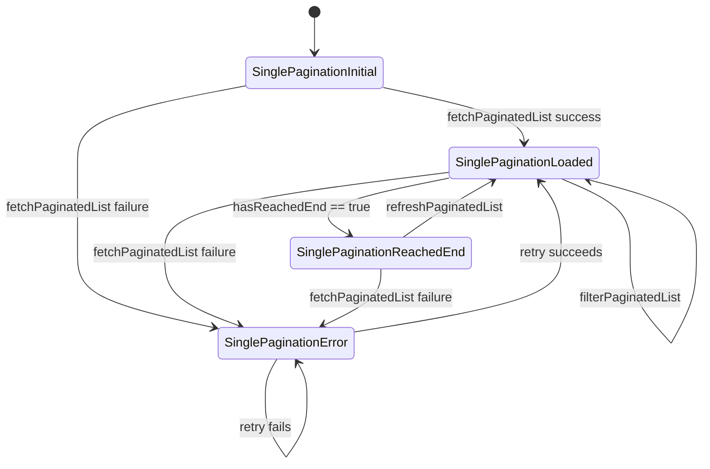

# Single Pagination (Callback Driven)

## Overview

`SinglePagination` is a lightweight, widget-driven pagination helper that works with any asynchronous data source. Instead of depending on repositories or HTTP clients, you provide a callback that returns `Future<List<T>>` and, optionally, a separate stream factory for live updates. The widget handles page state, loading/error UI, scroll-to-item helpers, and filtering hooks so you can focus on mapping your domain responses to `List<T>`.

> Works great with repository helpers such as `ClubsRepository.getRows` in `clubapp_core`, or any other method that exposes paginated lists.

## Quick Start

```dart
final controller = SinglePaginationController.of(
  request: const PaginationRequest(pageSize: 20),
  dataProvider: (request) => clubsRepository
      .getRows(ClubFilter(page: request.page, limit: request.pageSize ?? 20))
      .then((response) => response.items),
  streamProvider: (request) => clubsRepository.watchRows(
    ClubFilter(page: request.page, limit: request.pageSize ?? 20),
  ),
);

SinglePagination<Club>(
  request: const PaginationRequest(pageSize: 20),
  dataProvider: (request) => clubsRepository
      .getRows(ClubFilter(page: request.page, limit: request.pageSize ?? 20))
      .then((response) => response.items),
  streamProvider: (request) => clubsRepository.watchRows(
    ClubFilter(page: request.page, limit: request.pageSize ?? 20),
  ),
  itemBuilder: (context, items, index) => ClubTile(items[index]),
  controller: controller,
);
```

## Data Provider Contract

```dart
typedef PaginationDataProvider<T> = Future<List<T>> Function(PaginationRequest request);
typedef PaginationStreamProvider<T> = Stream<List<T>> Function(PaginationRequest request);
```

- The `PaginationRequest` carries the current page, `pageSize`, and optional filters.
- Returning fewer items than `pageSize` will automatically mark the end of the list.
- Provide `PaginationStreamProvider` when the backend exposes a watchable stream.

### PaginationRequest

```dart
const PaginationRequest(
  page: 1,
  pageSize: 20,
  filters: {'status': 'active'},
);
```

Fields are immutable; use `copyWith` when you need to adjust values.

### PaginationMeta

Every `SinglePaginationLoaded` state surfaces a `PaginationMeta` instance describing the last fetch (page, pageSize, hasNext, etc.).

## State Lifecycle



- **SinglePaginationInitial** - before the first fetch
- **SinglePaginationLoaded** - exposes `items`, `allItems`, and `meta`
- **SinglePaginationReachedEnd** - same as loaded with `hasReachedEnd == true`
- **SinglePaginationError** - wraps the thrown `Exception`

## Listeners & Helpers

- `SinglePaginationRefreshedChangeListener` - toggle `refreshed = true` to trigger a refresh
- `SinglePaginationFilterChangeListener<T>` - push a `WhereChecker<T>` to perform in-memory filtering
- `SinglePaginationOrderChangeListener<T>` - provide a `CompareBy<T>` sorter before rendering

Attach them through the `listeners` parameter; the widget wires them using `MultiProvider` automatically.

## Controller APIs

`SinglePaginationController` mirrors the cubit methods:

- `fetchPaginatedList({PaginationRequest? requestOverride, int? limit})`
- `refreshPaginatedList({PaginationRequest? requestOverride, int? limit})`
- `filterPaginatedList(WhereChecker<T>? predicate)`
- `insertEmit` / `addOrUpdateEmit`
- `scrollToItem` / `scrollToIndex`

## Tips

- Compare the returned list length with the requested `pageSize` to decide whether more data is available.
- For repository responses that include totals, use them to enrich `PaginationMeta` via the cubit's `copyWith` helpers if needed.
- Use `streamProvider` to bridge watch queries (e.g., local database streams) into the pagination flow.

## Testing

- **Cubit Tests** - mock the data provider and verify state transitions with `blocTest`
- **Widget Tests** - inject a fake provider that returns deterministic lists and assert loading/empty/content states

---

The module is now transport agnostic: bring your own async function and enjoy consistent pagination UI.
